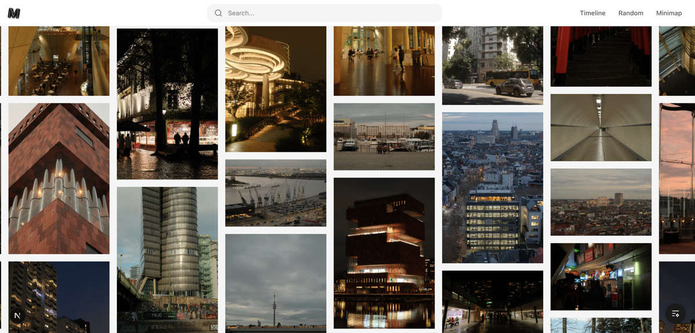
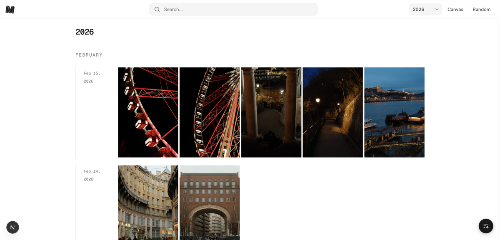
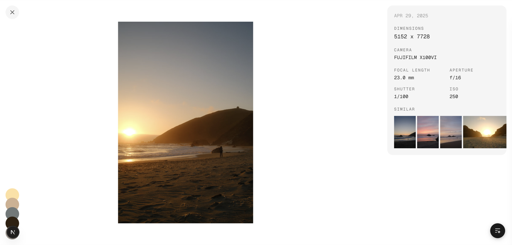

# Photos

A personal photo archive built with Next.js, featuring semantic search powered by AI embeddings and Cloudflare infrastructure.

## Screenshots

### Grid

The home page displays photos in a responsive masonry grid with near-square tiles optimized for fast initial loads. Supports semantic search via AI embeddings, so you can type a natural language query like "sunset over water" to find matching photos.



### Timeline

Browse photos chronologically, grouped by year, month, and day.



### Photo Detail

Full-size photo view with EXIF metadata (camera, lens, focal length, aperture, shutter speed, ISO), extracted dominant colors, and a row of visually similar photos.



## Structure

```
apps/
  web/              # Next.js photo archive app
  cli/              # Photo processing CLI (descriptions, embeddings, colors)
  search-worker/    # Cloudflare Worker for semantic search API
packages/
  eslint-config/    # Shared ESLint configuration
  typescript-config/ # Shared TypeScript configuration
```

## Getting Started

```bash
# Install dependencies
pnpm install

# Run development server
pnpm dev

# Build all packages
pnpm build

# Run linting
pnpm lint

# Run type checking
pnpm typecheck
```

## Environment Variables

Copy the example environment file in `apps/web`:

```bash
cp apps/web/.env.example apps/web/.env.local
```

Required variables:

- `R2_PUBLIC_URL` - Public URL for Cloudflare R2 storage
- `NEXT_PUBLIC_R2_URL` - Public R2 URL for client-side usage

Optional variables:

- `GROQ_API_KEY` - AI-generated photo descriptions
- `NOMINATIM_EMAIL` - Reverse geocoding for GPS coordinates
- `NEXT_PUBLIC_MAPBOX_TOKEN` - Map display on photo pages
- `REPLICATE_API_TOKEN` - ImageBind embeddings for semantic search

## Infrastructure

Infrastructure is managed with [Alchemy](https://github.com/sam-goodwin/alchemy) and deployed to Cloudflare:

- **R2 Bucket** - Photo storage
- **Vectorize Index** - Semantic search over photo embeddings
- **KV Namespace** - Embedding cache for search queries
- **Worker** - Search API (`apps/search-worker`)

```bash
# Deploy infrastructure
pnpm infra:deploy

# Tear down infrastructure
pnpm infra:destroy
```

## Deploy

The web app deploys to [Vercel](https://vercel.com). The search worker deploys to Cloudflare Workers via `pnpm infra:deploy`.
